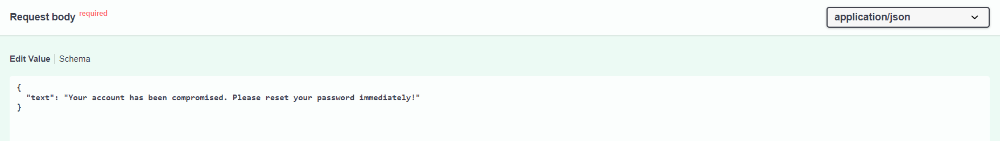
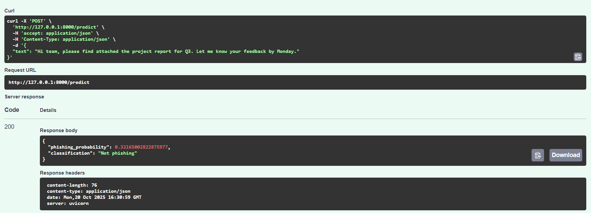
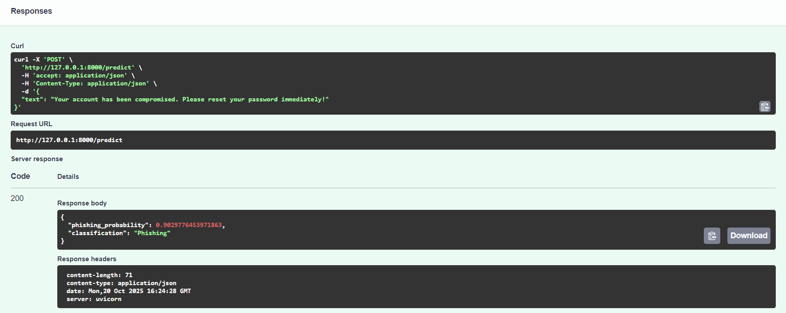
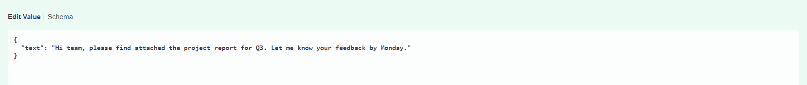
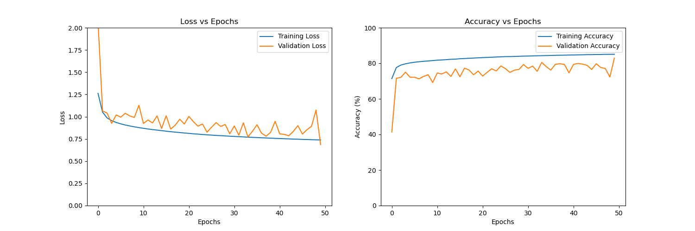

# Phishing Email Machine Learning Detection System API

A **machine learning powered phishing email detector** built with **PyTorch** and **FastAPI**, capable of analyzing raw email text and predicting whether it’s *phishing* or *legitimate*.  
This project demonstrates the full ML lifecycle, from **data preprocessing and model training** to **real-time API deployment**.

---

## Table of Contents
- [Overview](#overview)
- [Features](#features)
- [Tech Stack](#tech-stack)
- [Dataset](#dataset)
- [Feature Extraction](#feature-extraction)
- [Model Architecture](#model-architecture)
- [Training and Performance](#training-and-performance)
- [API Usage](#api-usage)
- [Results](#results)
- [Future Improvements](#future-improvements)
- [Setup Instructions](#setup-instructions)

---

## Overview

Phishing emails are one of the most common cybersecurity threats which uses social engineering to exploit vulnerable users to exploit and steal personal information about the victims.  
This project applies **machine learning**, **deep learning** and **natural language processing**  to automatically detect phishing attempts using linguistic, structural, and statistical features extracted from email text.

> **Goal:** Build an end-to-end phishing email classification pipeline and deploy it as a REST API for real-time predictions.

---

## Features

- End-to-end **ML pipeline** — from preprocessing to deployment  
- **Custom feature extraction** using text-based signals  
- Handles **imbalanced datasets** with SMOTE and class weighting  
- Lightweight **PyTorch neural network**  
- **FastAPI** backend for real-time predictions  
- Model scaling using **joblib** and **log-normalized inputs**  
- Easily deployable on platforms like Render, Hugging Face Spaces, or Heroku

---

## Tech Stack

| Category | Tools |
|-----------|-------|
| **Language** | Python |
| **Libraries** | PyTorch, scikit-learn, pandas, numpy, joblib, ntlk, spellchecker |
| **API Framework** | FastAPI |
| **Deployment** | Uvicorn / Render / Hugging Face Spaces |
| **Data Source** | [Kaggle – Email Phishing Dataset](https://www.kaggle.com/datasets/ethancratchley/email-phishing-dataset) |

---

## Dataset

- Source: Kaggle Email Phishing Dataset  
- Size: = **524,846 emails**  
- Class distribution: ~**98.6% legitimate** / **1.4% phishing** (highly imbalanced)
- Preprocessing: Removed nulls, normalized numeric features, extracted text-based features

> **Challenge:** The dataset’s imbalance required oversampling and class weighting to improve recall on phishing emails and fine tuning the model to get better results.

---

## Feature Extraction

The model does **not use raw text directly** instead, it extracts crafted features using `FeatureExtraction.py`, such as:

| Feature | Description |
|---------|-------------|
| `id1` | Total number of words |
| `id2` | Unique word count |
| `id3` | Number of stopwords |
| `id4` | Hyperlinks (`--link--` style or URLs) |
| `id5` | Number of unique domains detected |
| `id6` | Email addresses present |
| `id7` | Misspelled words (using `pyspellchecker`) |
| `id8` | Count of urgent words (e.g., "verify", "update", "urgent") |

These features are **log-transformed and scaled** since the data is high skewed to ensure smooth neural network training.

---

## Model Architecture

The MyModel class defines a fully connected neural network built using PyTorch.
It consists of three linear layers with **Batch Normalization, ReLU activations, and Dropout regularisation** to prevent overfitting.
This model is designed for binary classification tasks such as phishing email detection suggested by the lost function.

**Architecture Details**

- Input Layer: Takes X.shape[1] features
- Hidden Layer 1: 128 neurons, BatchNorm, ReLU, Dropout (0.3)
- Hidden Layer 2: 64 neurons, BatchNorm, ReLU, Dropout (0.3)
- Output Layer: 1 neuron (for binary output)

```python
class MyModel(nn.Module):
    def __init__(self):
        super(MyModel, self).__init__()
        self.fc1 = nn.Linear(X.shape[1], 128)
        self.bn1 = nn.BatchNorm1d(128)
        self.relu = nn.ReLU()
        self.fc2 = nn.Linear(128, 64)
        self.fc3 = nn.Linear(64, 1)
        self.bn2 = nn.BatchNorm1d(64)
        self.dropout = nn.Dropout(0.3)

    def forward(self, x):
        x = self.fc1(x)
        x = self.bn1(x)
        x = self.relu(x)
        x = self.dropout(x)
        x = self.fc2(x)
        x = self.bn2(x)
        x = self.relu(x)
        x = self.dropout(x)
        x = self.fc3(x)
        return x
```
---

## Training and Performance

**Training Setup**

| Setting | Value |
|-----------|-------|
| **Optimizer** | Adam (`lr=0.001`) |
| **Loss** | BCEWithLogitsLoss with `pos_weight` |
| **Imbalance Handling** | SMOTE + class weights |
| **Batch Size** | 50 |
| **Epochs** | 50 |
| **Train/Test/Validation Split** | 70% / 15% / 15% |

- The loss function used **BCEWithLogitsLoss(pos_weight=pos_weight_tensor)** since it applies **sigmoid function** which is needed for binary classificeation as well as **pos_weight** which weighs to give more importance to phishing emails in the dataset as they are imbalanced against it
- The **Adam** optimiser was used with a learning rate of **1e-4** chosen for its adaptive learning rate and faster convergence compared to **SGD**.

**Training Metrics Visualised**
- Loss vs Epoch
- Accuracy vs Epoch
- Confusion Matrix per epoch
- Precision / Recall / F1-score per class

---

## API Usage

**Running the API**

The **API** is made using **FastAPI** an can be run by using this command:
```bash
uvicorn main:app --reload
```
**Interactive API Documentation**
- Once the server is running, open http://127.0.0.1:8000/docs to access **Swagger UI**.
- You can try **POST requests directly from the browser**, see request/response formats, and test the `/predict` endpoint interactively

**POST Request Example 1**


**POST Response Example 1**


**POST Request Example 2**


**POST Response Example 2**


---

## Results

**Vaildation and Traning Graphs**

*Figure 1*

Figure 1: Validation accuracy is slightly lower than training accuracy (and validation loss is higher) because the model prioritises **recall for phishing emails** (recall is when of all the emails predicted as phishing, which are truly phishing). In phishing detection, catching as many malicious emails as possible is far more important than achieving the highest overall accuracy or precision, especially on an extremely imbalanced dataset. Accuracy and precision alone can be misleading metrics in this context.

---

**Confuion Matrix**

```bash
Test Accuracy: 75.5294%

Confusion Matrix:
[[58610 19074]
 [  191   852]]

Classification Report:
              precision    recall  f1-score   support

    Safe (0)     0.9968    0.7545    0.8588     77684
Phishing (1)     0.0428    0.8169    0.0813      1043

    accuracy                         0.7553     78727
   macro avg     0.5198    0.7857    0.4701     78727
weighted avg     0.9841    0.7553    0.8485     78727

```

This model achieved an accuracy of 75.5%, but due to the severe class imbalance, accuracy is not the primary metric of interest. Instead, the model was optimized for high recall on the phishing class, achieving **81.69%** recall. This means that the majority of phishing emails are successfully detected, which is crucial in real-world cybersecurity applications where false negatives pose a greater risk than false positives. Although precision for phishing is low (4.08%) due to many safe emails being flagged as phishing, this trade-off is acceptable in favor of safety.

---

## Future Improvements
- Add BERT / Transformer embeddings for deeper NLP understanding
-  Integrate XGBoost / Random Forest for model comparison
-  Deploy using Docker + CI/CD pipeline
-  Add JWT authentication + logging for API security
-  Train on multiple real-world email datasets for robustness

---

## Setup Instructions

```bash
git clone https://github.com/rCats-s/PhishingEmailDetection
cd phishing-email-detector

# Create environment
python -m venv env
source env/bin/activate 

# Install dependencies
pip install -r requirements.txt

# Train the model
python email-phishing-api.py

# Run the Prediction and API
python main.py

# Start FastAPI server
uvicorn main:app --reload
```


